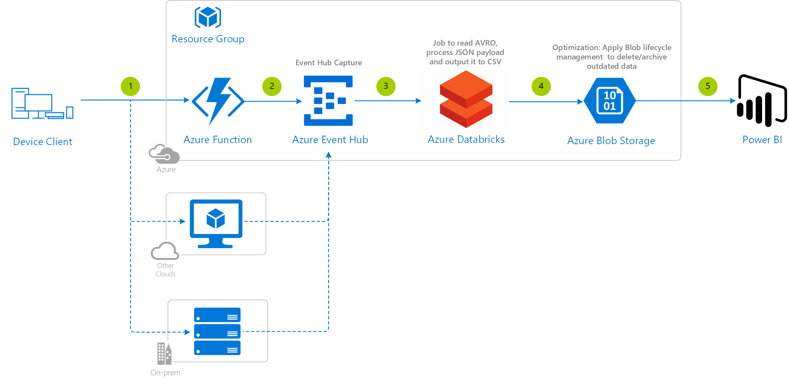
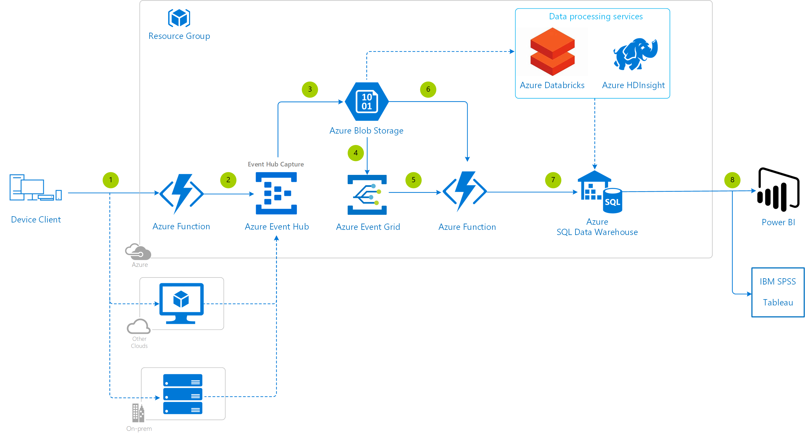

# Non-real Time Dashboard Reference Architectures

This reference architecture represents a simple analytics pipeline that you can build on Azure. It can be leveraged when **you won't be tracking data that requires real-time analysis** and instead you just plan to do review sessions of the data every now and then (daily, weekly, bi-weekly, monthly). The presentation layer is a dashboard that you will be able to customize at will. You could use this while you are developing your game and in production.

## Gathering analytics in a small scale

This article will describe the architecture used in [this sample on GitHub](https://github.com/Azure-Samples/gaming-nonrealtime-analytics). Keep in mind that the code from this reference architecture is only an example for guidance and there may be places to optimize the code before using in a production environment.

### Architecture diagram

[](media/analytics/analytics-non-real-time-dashboard.png)

### Relevant services

- [Azure Function](https://docs.microsoft.com/azure/azure-functions/functions-overview) - Used as the API receiving the events from the device clients.
- [Azure Event Hub](https://azure.microsoft.com/services/event-hubs/) - A service tailored for analytics pipelines and is simple to use with little configuration or management overhead. As a bonus, it will be also usable if you decide later on that you would like to process events in real-time.
- [Azure Databricks](https://docs.microsoft.com/azure/azure-databricks/what-is-azure-databricks) - Transforms the data from Azure Event Hubs Capture (AVRO format) to JSON files, and also converts the data into CSV files compatible with Power BI. Streaming data from Azure Event Hubs to Azure Blob Storage in a performant way is not entirely trivial, unless it's a very small scale.
- [Azure Blob Storage](https://docs.microsoft.com/azure/storage/blobs/storage-blobs-overview) - Optimized for storing  massive amounts of unstructured data.
- [Power BI](https://powerbi.microsoft.com/) - A fully customizable dashboard. Note that Azure can integrate with other data visualization products like IBM SPSS or Tableau, but at the moment those can't connect directly with Azure Blob Storage.  Please see the alternative architecture below leveraging Azure SQL Data Warehouse if you are interested in using these data visualization products.

### Step by step

1. Invoke the **Azure Function** from the device client. Alternatively you could have use virtual machines with a load balancer.
2. Transfer data from the Azure Function to the **Azure Event Hubs**.
3. Using the out-of-the-box **Event Hub Capture**, AVRO files are generated containing the data.
4. An **Azure Databricks** job reads the data from the AVRO files and extracts the JSON events in the payload. Azure Databricks does the data preparation and deposits the output (CSV files) into **Azure Blob Storage**.
5. **Power BI** reads the CSV files stored in Azure Blob Storage and display them in a dashboard/report.

### Deployment template

Click the following button to deploy the project to your Azure subscription:

<a href="https://aka.ms/arm-gaming-nonrealtime-analytics" target="_blank"></a>

This operation will trigger a template deployment of the [azuredeploy.json](https://github.com/Azure-Samples/gaming-nonrealtime-analytics/blob/master/azuredeploy.json) ARM template file to your Azure subscription, which will create the necessary Azure resources. This may induce charges in your Azure account.

Have a look at the [general guidelines documentation](./general-guidelines.md#naming-conventions) that includes a section summarizing the naming rules and restrictions for Azure services.

>[!NOTE]
> If you're interested in how the ARM template works, review the Azure Resource Manager template documentation from each of the different services leveraged in this reference architecture:
>
> - [Create an Event Hub using Azure Resource Manager template](https://docs.microsoft.com/azure/event-hubs/event-hubs-resource-manager-namespace-event-hub)
> - [Automate resource deployment for your function app in Azure Functions](https://docs.microsoft.com/azure/azure-functions/functions-infrastructure-as-code)
> - [Azure Databricks workspace template](https://github.com/Azure/azure-quickstart-templates/tree/master/101-databricks-workspace/)

Add these Function [application settings](https://docs.microsoft.com/azure/azure-functions/functions-how-to-use-azure-function-app-settings) so the sample project can connect to the Azure services:

- EVENTHUB_CONNECTION_STRING - The [connection string](https://docs.microsoft.com/azure/event-hubs/event-hubs-get-connection-string) to the Azure Event Hub namespace that was created

Next, [start the Azure Databricks cluster](https://docs.azuredatabricks.net/user-guide/clusters/start.html) either through the portal or API.

Then either mount the Azure Storage account using DBFS, or setup the access key for directly using APIs. See the document on how to [access Azure Blob Storage from Azure Databricks](https://docs.databricks.com/spark/latest/data-sources/azure/azure-storage.html) for all the details. The recommended path is leveraging [secrets](https://docs.databricks.com/user-guide/secrets/secrets.html#secrets) and mounting a container or a folder within the container, then access files as if they were local files.

Finally go to the Azure Databricks cluster that you created, then go to the folder you want to use (or create a new one), select **Import**, then **URL** and use [this script](https://github.com/Azure-Samples/gaming-nonrealtime-analytics/blob/master/avro_sample.py) to import the **Notebook**.

>[!TIP]
> To run the Azure Functions locally, update the *local.settings.json* file with these same app settings.

### Implementation details

Including a *version* number will be helpful once the tracked parameters evolve in future game updates.

#### Event Hub partitions

Have a look at the [general guidelines documentation](./general-guidelines.md#azure-event-hub-partitions) to understand the Azure Event Hub requirements and the rule of thumb to select the partition count.

#### Blob storage performance and limits

Have a look at the [general guidelines documentation](./general-guidelines.md#azure-storage-account-limits) to learn more about the limits of an Azure storage account and how to avoid throttling.

#### API

In this reference architecture, the API is going to be implemented via an Azure Function (serverless), so you do not have to consider load balancing and scaling servers. The input of the Azure Function is going to be an [HTTP trigger](https://docs.microsoft.com/azure/azure-functions/functions-bindings-http-webhook#trigger) and the output will be an [Event Hub](https://docs.microsoft.com/azure/azure-functions/functions-bindings-event-hubs#output).

```csharp
[return: EventHub("ehnrtanalytics-output", Connection = "EventHubConnectionAppSetting")]
    public static async Task<IActionResult> Run([HttpTrigger(AuthorizationLevel.Function, "get", "post", Route = null)] HttpRequest req, ILogger log)
```

#### Azure Databricks jobs

The goal is to keep the amount of time the Azure Databricks cluster is running to a minimum. Setup the cluster to [terminate after a few minutes of inactivity](https://docs.azuredatabricks.net/user-guide/clusters/terminate.html). Then [schedule an Azure Databricks Notebook](https://docs.azuredatabricks.net/user-guide/notebooks/notebook-manage.html#schedule-notebook) every day, for example.

#### Power BI dashboard

The list of steps to pull the information from the Azure Blob Storage and prepare the data for visualization is:

1. Open **Power BI**.
1. Select **Get Data** and pick **Azure**.
1. Choose **Azure Blob Storage**.
1. You will be asked for the URL, which you can find in the Azure Portal:
    1. Open the **resource group**.
    1. Select the **Storage account**.
    1. Select **Blobs** (in the left menu under Blob service).
    1. Select the **path** (ehcapture-analytics in this example)
    1. Finally, you'll find the URL in the **Properties** section
1. You will be asked for the **Storage account key**, which can also be found in the Azure portal:
    1. Open the **resource group**.
    1. Select the **Storage account**.
    1. Select **Access keys** (in the left menu under Settings).
    1. Copy the **key only**, not the connection string.
1. Then Power BI will connect with the Azure Blob Storage and display a preview of some files discovered. Click **Load**.
1. To **massage the data**:
    1. Select **Edit Queries**.
    1. Filter the Name column to CSV so only those types of files show up.
    1. Click on the **Combine Files icon** (it looks like two arrows pointing downwards) from the Content column.
    1. A pop up dialog will prompt, click on the Ok button.
    1. Close and apply.
1. Select the fields to display in the query and start adding them to the dashboard in any of the available Power BI visualizations.

### Security considerations

Do not hard-code any Event Hub or Cognitive Services connection strings into the source of the Function.  Instead, at a minimum, leverage the [Function App Settings](https://docs.microsoft.com/azure/azure-functions/functions-how-to-use-azure-function-app-settings#manage-app-service-settings) or, for even stronger security, use [Key Vault](https://docs.microsoft.com/azure/key-vault/) instead. There is a tutorial explaining how to [create a Key Vault](https://blogs.msdn.microsoft.com/benjaminperkins/2018/06/13/create-an-azure-key-vault-and-secret/), how to [use a managed service identity with a Function](https://blogs.msdn.microsoft.com/benjaminperkins/2018/06/13/using-managed-service-identity-msi-with-and-azure-app-service-or-an-azure-function/) and finally how to [read the secret stored in Key Vault from a Function](https://blogs.msdn.microsoft.com/benjaminperkins/2018/06/13/how-to-connect-to-a-database-from-an-azure-function-using-azure-key-vault/).

Review the [Event Hub authentication and security model overview](https://docs.microsoft.com/azure/event-hubs/event-hubs-authentication-and-security-model-overview) and put it into practice to ensure only your chat server can talk to the Event Hub.

### Optimization considerations

You can transition blobs stored in Azure Blob Storage to a "cooler" storage tier (Hot to Cool, Hot to Archive, or Cool to Archive), or delete blobs at the end of their lifecycles to **optimize for performance and cost** using [Azure Blob Storage lifecycle management policy](https://docs.microsoft.com/azure/storage/blobs/storage-lifecycle-management-concepts).

### Alternatives

You could consider replacing [Azure Databricks](https://docs.microsoft.com/azure/azure-databricks/what-is-azure-databricks) with [Azure HDInsight](https://docs.microsoft.com/azure/hdinsight/).  The main difference in this scenario is Azure Databricks handles spinning up/down clusters for you, while with Azure HDInsight you have to take care of that yourself

## Gathering analytics in a large scale

### Architecture diagram

[](media/analytics/analytics-sql-data-warehouse.png)

### Implementation details

Leveraging [Azure Event Hubs Capture](https://docs.microsoft.com/azure/event-hubs/event-hubs-capture-overview) and [Azure Event Grid](https://docs.microsoft.com/azure/event-grid/overview) you can get the data sent by your players into Azure SQL Data Warehouse. For a full step-by-step walkthrough, see [migrate captured Event Hubs data to a SQL Data Warehouse using Event Grid and Azure Functions](https://docs.microsoft.com/azure/event-hubs/store-captured-data-data-warehouse), including how to use [Power BI with SQL Data Warehouse](https://docs.microsoft.com/azure/sql-data-warehouse/sql-data-warehouse-integrate-power-bi).

### Deployment template

Click the following button to deploy the project to your Azure subscription:

<a href="https://portal.azure.com/#create/Microsoft.Template/uri/https%3A%2F%2Fraw.githubusercontent.com%2FAzure%2Fazure-docs-json-samples%2Fmaster%2Fevent-grid%2FEventHubsDataMigration.json" target="_blank"></a>

This operation will trigger a template deployment of the [EventHubsDataMigration.json](https://raw.githubusercontent.com/Azure/azure-docs-json-samples/master/event-grid/EventHubsDataMigration.json) ARM template file to your Azure subscription, which will create the necessary Azure resources.

Have a look at the [general guidelines documentation](./general-guidelines.md#naming-conventions) that includes an article summarizing the naming rules and restrictions for Azure services.

### Involving Azure Databricks and Azure HDInsight

Optionally you can choose to prepare data outside of your warehouse to leverage new skills and tooling that are emerging in your studio.

- With [Azure Databricks](https://docs.microsoft.com/azure/azure-databricks/what-is-azure-databricks), data scientists can use the full power of the Databricks Runtime with a variety of language choices to develop ETL (extract, transform, load) processes that can scale as your game grows, and write the data directly into Azure SQL Data Warehouse.
- Or you could also perform fast, interactive SQL queries at scale over structured or unstructured data produced by your game by hooking up Azure SQL Data Warehouse with [Azure HDInsight](https://docs.microsoft.com/azure/hdinsight/).

## Additional resources and samples

- [Azure Event Hubs SDK for Unity](https://docs.microsoft.com/sandbox/gamedev/unity/azure-event-hubs-unity) - This is a sandbox project. The content in this article is unsupported, and therefore may be out of date or not in a working state.
- [Deploy Tableau Server via Azure Marketplace](https://azure.microsoft.com/blog/tableau-server-in-the-azure-marketplace/)
- [Tableau Server in the Azure Marketplace](https://azuremarketplace.microsoft.com/marketplace/apps/tableau.tableau-server?tab=Overview)

## Pricing

If you don't have an Azure subscription, create a [free account](https://aka.ms/azfreegamedev) to get started with 12 months of free services. You're not charged for services included for free with Azure free account, unless you exceed the limits of these services. Learn how to check usage through the [Azure Portal](https://docs.microsoft.com/azure/billing/billing-check-free-service-usage#check-usage-on-the-azure-portal) or through the [usage file](https://docs.microsoft.com/azure/billing/billing-check-free-service-usage#check-usage-through-the-usage-file).

You are responsible for the cost of the Azure services used while running these reference architectures.  The total amount will vary based on usage. See the pricing webpages for each of the services that were used in the reference architecture:

- [Azure Functions](https://azure.microsoft.com/pricing/details/functions/)
- [Azure Event Hubs pricing](https://azure.microsoft.com/pricing/details/event-hubs/)
- [Azure Cosmos DB pricing](https://azure.microsoft.com/pricing/details/cosmos-db/)
- [Azure Virtual Machines pricing](https://azure.microsoft.com/pricing/details/virtual-machines)
- [Azure Stream Analytics pricing](https://azure.microsoft.com/pricing/details/stream-analytics/)
- [Azure Event Grid pricing](https://azure.microsoft.com/pricing/details/event-grid/)
- [Azure SQL Data Warehouse](https://azure.microsoft.com/pricing/details/sql-data-warehouse/gen2/)
- [Azure Databricks](https://azure.microsoft.com/pricing/details/databricks/)
- [Azure HDInsight](https://azure.microsoft.com/pricing/details/hdinsight/)

You can also use the [Azure pricing calculator](https://azure.microsoft.com/pricing/calculator/) to configure and estimate the costs for the Azure services that you are planning to use. Prices are estimates and are not intended as actual price quotes. Actual prices may vary depending upon the date of purchase, currency of payment, and type of agreement you enter with Microsoft. Contact a Microsoft sales representative for additional information on pricing.