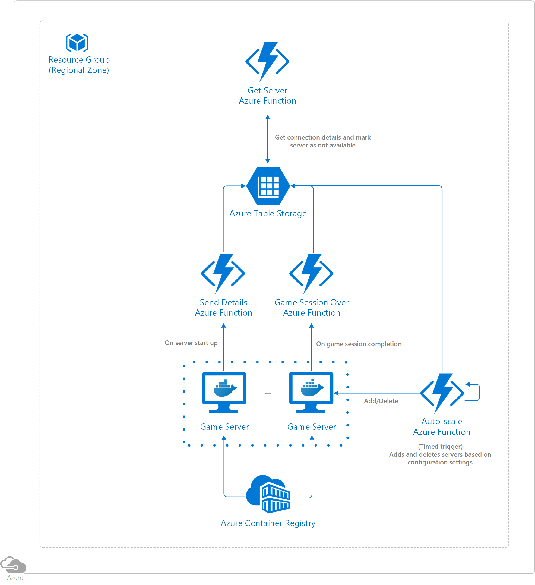

# Custom Game Server Scaling Reference Architecture

See how to encapsulate your game server with Docker and build a reliable and automated deployment process of the game server using Azure Resource Manager templates, Azure Functions and DevOps practices.

Refer to [Orchestrating and scaling Icebird's game server with Docker and Azure](https://microsoft.github.io/techcasestudies/devops/azure%20app%20service/azure%20functions/2017/04/21/IceBird.html) to read all the details. There is both **source code** and a **deployment template** available on [GitHub](https://github.com/Annonator/FuncyAutoScale).

## Architecture diagram

## Reference implementation details

Each virtual machine includes a docker container that runs a game session. As soon as the virtual machine starts, it puts a docker container inside and open the pertinent port(s) through a custom script extension ([Linux](https://docs.microsoft.com/azure/virtual-machines/extensions/custom-script-linux), [Windows](https://docs.microsoft.com/azure/virtual-machines/extensions/custom-script-windows)). Every container have it's own public dedicated IP address.

Then there is a **get server Azure Function**, that runs on an app service with an plan. The only consideration that needs to be made here is scale, [App service environment](https://docs.microsoft.com/azure/app-service/environment/intro) gives you the highest scale. Any app service must have an storage account and the Azure Function already provisions it. In the storage account, an [Azure Table Storage](https://docs.microsoft.com/azure/storage/tables/table-storage-overview) is leveraged to store the pool of servers information. including the unique identifier of the server, IP, Port and other stuff like status. This *get server Azure Function* knows what servers are in the pool, their status, connection details, etc. When invoked, it returns the connection details of a server that is available, and mark is as not-available when it's being used.

Also there is an **auto-scale Azure Function**, that it's time triggered. Every minute or so, it looks how many servers are available and whether more servers are required, and if so it adds them. If it detects that a server is not in-use, it deprovisions it. You can set up how many servers do you want to have warm in the pool.

Once a game server starts, it needs to talk to a third *send details Azure Function* to announce its existence, so the pertinent connection information can be updated into the Azure Table Storage.

After a game session is finished, the game server pings a fourth **game session over Azure Function** when the game is finished, that updates the state of the Azure Table Storage for that specific server.

Ultimately the goal is to free up the virtual machines as fast as possible, so this architecture is focusing on having a single game session per virtual machine only.

Keep an eye on the [Azure limits](https://aka.ms/azurelimits) page to know how many concurrent users you would be able to run based on the Azure Storage limitations. If you need to scale consider replacing Azure Table storage with Azure Cosmos DB and the table API.

## Pricing

If you don't have an Azure subscription, create a [free account](https://aka.ms/azfreegamedev) to get started with 12 months of free services. You're not charged for services included for free with Azure free account, unless you exceed the limits of these services. Learn how to check usage through the [Azure Portal](https://docs.microsoft.com/azure/billing/billing-check-free-service-usage#check-usage-on-the-azure-portal) or through the [usage file](https://docs.microsoft.com/azure/billing/billing-check-free-service-usage#check-usage-through-the-usage-file).

You are responsible for the cost of the Azure services used while running these reference architectures, the total amount depends on the number of events that will run though the analytics pipeline. See the pricing webpages for each of the services that were used in the reference architectures:

- [Azure Windows Virtual Machines](https://azure.microsoft.com/pricing/details/virtual-machines/windows/)
- [Azure Linux Virtual Machines](https://azure.microsoft.com/pricing/details/virtual-machines/linux/)
- [Azure Disk Storage](https://azure.microsoft.com/pricing/details/managed-disks/)
- [Azure Functions](https://azure.microsoft.com/pricing/details/functions/)
- [Azure Container Registry](https://azure.microsoft.com/pricing/details/container-registry/)
- [Azure Table Storage](https://azure.microsoft.com/pricing/details/storage/tables/)

You also have available the [Azure pricing calculator](https://azure.microsoft.com/pricing/calculator/), to configure and estimate the costs for the Azure services that you are planning to use.