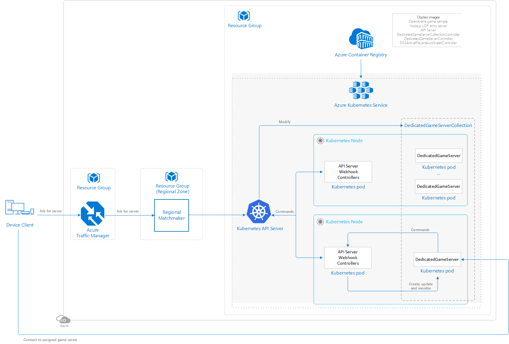
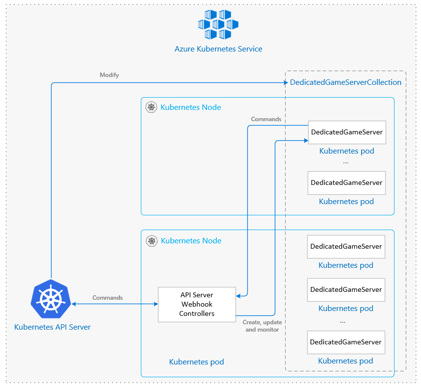

# Synchronous Multiplayer Using Azure Kubernetes Service (AKS)

You can opt to manage containerized dedicated game servers using the Kubernetes orchestrator on Azure using the managed Azure Kubernetes Service (AKS).

We're going to describe the solution listed here on [GitHub](https://github.com/dgkanatsios/AzureGameServersScalingKubernetes). Keep in mind that the code from this reference architecture is only an example for guidance and there may be a few places to optimize the code pattern before it's ready for production.

## Architecture diagram

## Relevant services

- [Azure Traffic Manager](https://docs.microsoft.com/azure/traffic-manager/traffic-manager-overview) - Selected as it connects the player to the most appropiate regional zone based on latency.
- [Azure Kubernetes Service](https://azure.microsoft.com/services/kubernetes-service/) - Simplifies the deployment and operations of Kubernetes.
- [Azure Container Registry](https://azure.microsoft.com/services/container-registry/) - Allows storing images for all types of container deployments.
- [Resource Groups](https://docs.microsoft.com/azure/azure-resource-manager/resource-group-portal#manage-resource-groups) - Leverage one resource group for the Azure Traffic Manager and one resource group for each regional game server pool (i.e: one for North America, another for Europe, another for LATAM, another for Asia, etc).

## Architecture considerations

### Custom resource definitions (CRDs)

In this reference architecture, Kubernetes is extended by using [Custom Resource Definition (CRDs)](https://kubernetes.io/docs/concepts/extend-kubernetes/api-extension/custom-resources/) objects. These objects will be used to represent the dedicated game server entities.

Specifically, there are 2 core entities, which are represented by 2 respective CRDs:

- **DedicatedGameServer**: represents the multiplayer game server itself. Each DedicatedGameServer has a single corresponding child [Pod](https://kubernetes.io/docs/concepts/workloads/pods/pod/) which will run the container image with the game server executable.
- **DedicatedGameServerCollection**: represents a collection/set of related DedicatedGameServers that will run the same Pod template and can be scaled in/out within the collection (i.e. add or remove more instances of them).

    DedicatedGameServers that are members of the same DedicatedGameServerCollection have a lot of similarities in their execution environment, e.g. all of them could launch the same multiplayer map or the same type of game. So, you could have one collection for a "Capture the flag" mode of your game and another collection for a "Conquest" mode. Or, a collection for players playing on map "X" and a collection for players playing on map "Y".

### Components

This reference architecture contains 2 main components, both of which are created as a single instance Kubernetes [Deployments](https://kubernetes.io/docs/concepts/workloads/controllers/deployment/):

1. **API Server components**

    This is our project's API server (that has nothing to do with Kubernetes API Server). It contains two sub-components:

    1. API Server subcomponent

        It provides REST APIs that can be called by either the game server or an external scheduling system (e.g. a lobby service or a matchmaker).

    2. Webhook subcomponent

        A Kubernetes [admission webhook](https://kubernetes.io/docs/reference/access-authn-authz/extensible-admission-controllers/#admission-webhooks), it validates and modifies requests about our CRDs to the Kubernetes API Server.

2. **Controllers**

    Kubernetes controllers are objects that are active reconciliation processes. In simple words, this means that a controller watches an object (or a set of objects) for its desired state as well as its actual state. It actively compares them and makes every effort to bring the actual state to look like the desired state.

    This project contains a set of controllers, each one carrying the task to reconcile a specific set of objects. All controllers are based on the official Kubernetes [sample controller](https://github.com/kubernetes/sample-controller) and the respective documentation here. Controllers in this project were made in order to reconcile our Custom Resource Definition (CRD) objects, i.e. the DedicatedGameServerCollections and the DedicatedGameServers.

    1. DedicatedGameServerCollectionController

        It has the duty of handling the DedicatedGameServer objects of a DedicatedGameServerCollection.

    2. DedicatedGameServerController

        It has the duty of handling the Pods of a DedicatedGameServer object.

    3. DGSActivePlayersAutoScalerController

        It is optionally started (via a command line argument on the controller) and is responsible for Pod Autoscaling on every DedicatedGameServerCollection that opts into the pod autoscaling mechanism.

These components are part of their own namespace (named **dgs-system** in the sample), separated from the namespace of the DedicatedGameServers. In a big cluster scenario, you could have a namespace per list of DedicatedGameServerCollections.

### Public IPs

Game clients should be able to connect directly to a Dedicated Game Server, so all Nodes should have a Public IP. Azure Kubernetes Services does not provide a public IP by default, use this [GitHub](https://github.com/dgkanatsios/AksNodePublicIPController) project to enable that.

## Deployment template

Follow these [instructions](https://github.com/dgkanatsios/azuregameserversscalingkubernetes/blob/master/docs/installation.md) to create the Azure Kubernetes Cluster. 

## Security considerations

All API methods are protected via an access code, represented as string and kept in a Kubernetes Secret called `apiaccesscode`. This is created during project's installation and should be passed in all method calls code GET parameter. The only method that does not require authentication by default is the `/running` one. This, however, can be changed in the API Server process command line arguments.

## Optimization considerations

For smaller clusters you can simplify by using a single Pod (the one containing the API Server subcomponent, Webhook subcomponent and controllers) for all the Nodes. In a Kubernetes cluster, every Pod can talk to other Pods in all other Nodes by design.

## Additional resources and samples

[Official Kubernetes documentation](https://kubernetes.io/docs/concepts/overview/what-is-kubernetes/)

## Pricing

If you don't have an Azure subscription, create a [free account](https://aka.ms/azfreegamedev) to get started with 12 months of free services. You're not charged for services included for free with Azure free account, unless you exceed the limits of these services. Learn how to check usage through the [Azure Portal](https://docs.microsoft.com/azure/billing/billing-check-free-service-usage#check-usage-on-the-azure-portal) or through the [usage file](https://docs.microsoft.com/azure/billing/billing-check-free-service-usage#check-usage-through-the-usage-file).

You are responsible for the cost of the Azure services used while running these reference architectures, the total amount depends on the number of events that will run though the analytics pipeline. See the pricing webpages for each of the services that were used in the reference architectures:

- [Azure Traffic Manager](https://azure.microsoft.com/pricing/details/traffic-manager/)
- [Azure Kubernetes Service](https://azure.microsoft.com/pricing/details/kubernetes-service/)
- [Azure Container Registry](https://azure.microsoft.com/pricing/details/container-registry/)

You also have available the [Azure pricing calculator](https://azure.microsoft.com/pricing/calculator/), to configure and estimate the costs for the Azure services that you are planning to use.